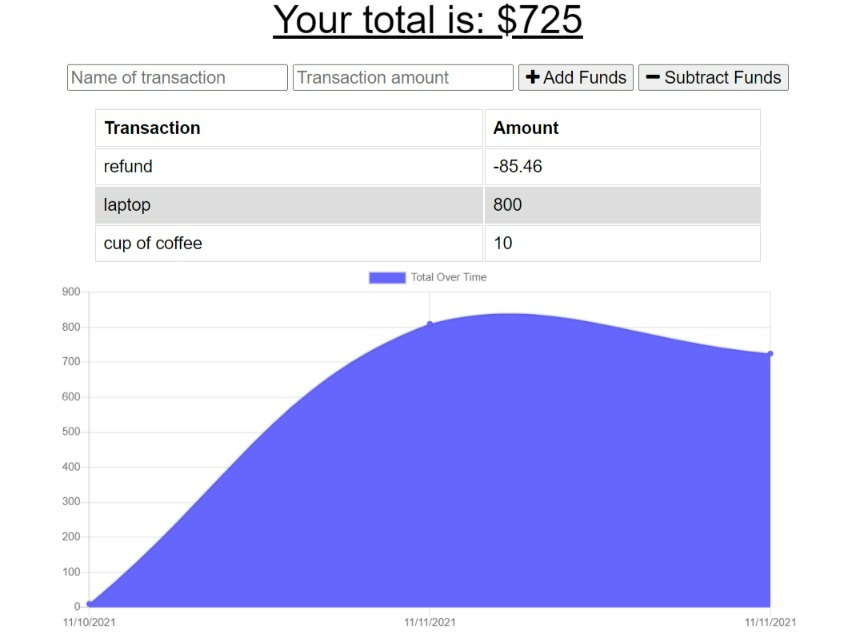

# Offline Budget Tracker

## Usage
To use this app, follow the link provided to the live project.

Enter transactions and select  add or subtract funds

## Summary
For this project we added and modified code to give this Budget app offline functionality.The functionality was provided by using a manifest and service worker to save data to offline storage caches.

## Installing
no installation needed.

## Deployed Link:
[Budget Tracker Repo](https://github.com/dcarter45/budget-tracker)

[Heroku Live app](https://guarded-shelf-02222.herokuapp.com/)

## Learning Points:
* This app was a practice in writing code for manifest and service worker files  and working with local storage.

## Built With
* [JavaScript](https://developer.mozilla.org/en-US/docs/Web/JavaScript)
* [NodeJS](https://nodejs.org/)
* [Mongoose](https://www.npmjs.com/package/mongoose-morgan)
 

## Authors
Darrell Carter
* [GitHub](https://github.com/dcarter45)
* [LinkedIn](https://www.linkedin.com/in/darrell-carter-5030a3a9/)

## License
MIT
